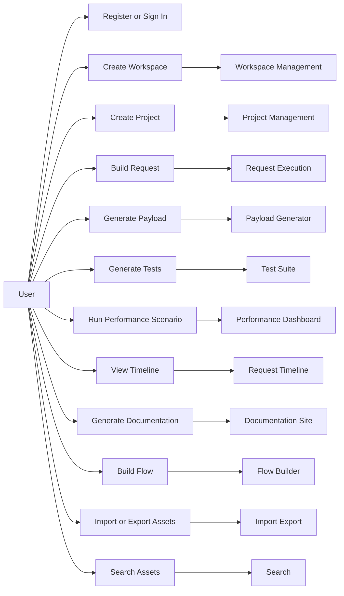

# Use Case Diagram

## Summary

The following use cases define the primary interactions of the API Forge platform.

## Notes

This diagram is intentionally high-level and does not define internal implementation structure.
