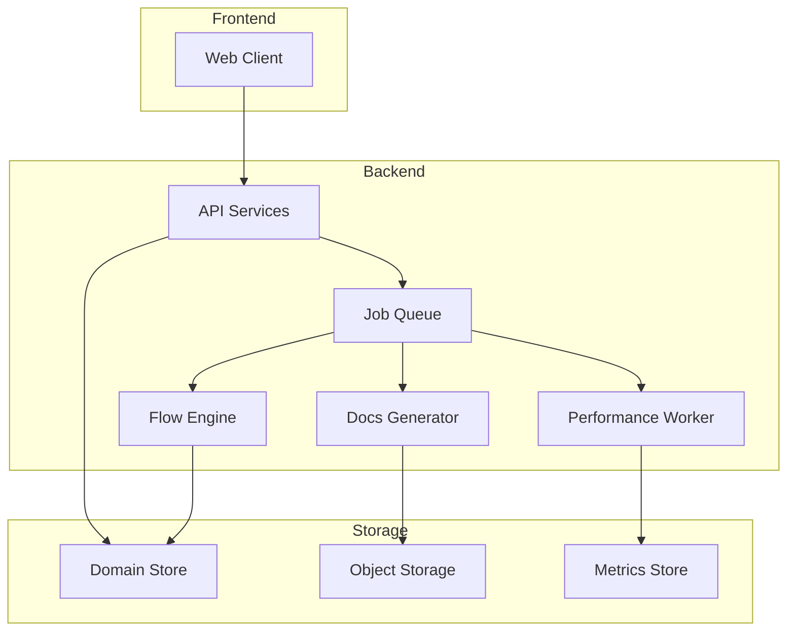

# High-Level Architecture

## Architecture Summary

API Forge should follow a modular service-oriented architecture with a web frontend, application services, execution workers, and shared data stores.

## Proposed Layers

### Presentation Layer

- Web client for request builder, collections, flows, documentation, and dashboarding.

### Application Layer

- Identity and access control.
- Workspace and project management.
- Request management.
- Documentation orchestration.
- Flow orchestration.
- Import and export pipeline.

### Execution Layer

- Request execution engine.
- Background job workers.
- Performance workers.
- Metadata and metrics collectors.

### Data Layer

- Relational or document store for domain entities.
- Object store for snapshots and exports.
- Queue and message broker for asynchronous jobs.

## Architectural Notes

- Interactive request execution remains lightweight and event-driven.
- Performance jobs should be isolated from the main request path.
- Documentation generation should rely on deterministic data pipelines with optional AI-assisted enrichment.

## Architecture Diagram

