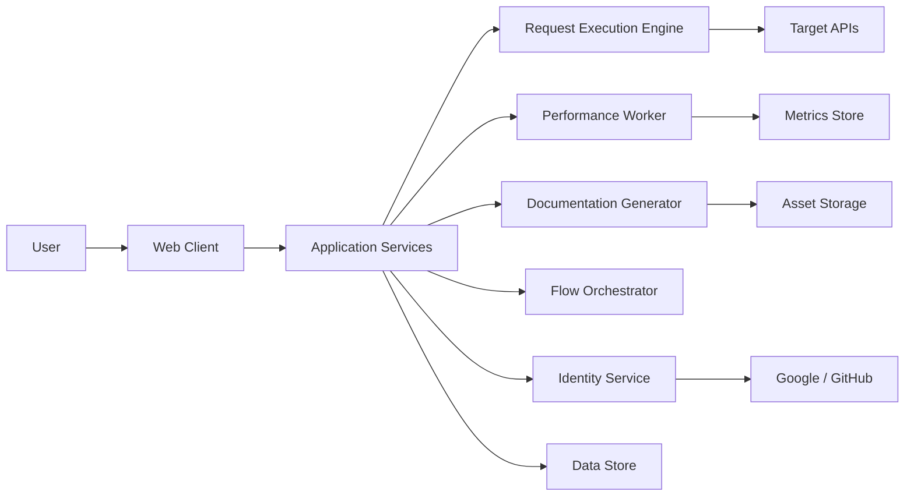

# System Context

## Overview

API Forge operates as a multi-user API development platform that integrates request authoring, execution, performance visibility, documentation generation, and workflow automation.

## External Actors

- End users
- OAuth providers
- Email gateway
- AI-assisted generation provider
- Background worker infrastructure
- Object storage
- Metrics and tracing systems

## System Boundaries

The product boundary includes:

- Web client for request composition and viewing.
- Application services for authentication and workspace logic.
- Execution services for HTTP and background jobs.
- Metrics ingestion and dashboarding.
- Documentation generation pipeline.
- Flow orchestration and job execution services.

## Context Diagram

## Design Principles

- Stateless API services where possible.
- Isolated performance execution.
- Explicit consent for AI-assisted workflows.
- Secret masking and safe export defaults.
